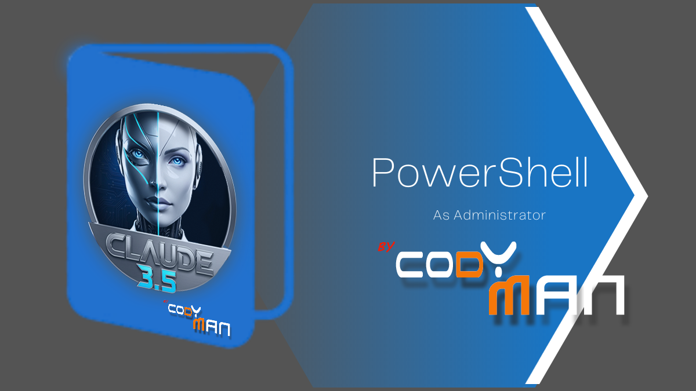

# 🚀 Profil PowerShell Personnalisé

[](https://github.com/PowerShell/PowerShell)
[](https://github.com/microsoft/terminal)
[](https://github.com)

> 🛠️ Un profil PowerShell personnalisé optimisé pour le développement, avec une interface utilisateur améliorée et des commandes pratiques.



## ✨ Fonctionnalités

### 🎯 Commandes et Alias
- `ll` : Lister les fichiers (comme sur Linux)
- `g` : Raccourci pour git
- `which` : Trouver l'emplacement des commandes
- `help` : Afficher la liste des commandes disponibles

### 🗂️ Navigation
- `..` : Remonter d'un niveau
- `mkcd` : Créer un dossier et y accéder directement
- `tree` : Afficher l'arborescence des dossiers

### 📦 Git
- `gs` : Git status
- `gb` : Git branch
- Affichage automatique de la branche Git dans l'invite de commande
- Intégration Git dans le prompt PowerShell

### 💻 Développement
- `nv` : Afficher la version de Node.js
- Support UTF-8 par défaut
- Détection et affichage des versions de :
  - 📗 Node.js
  - 📦 npm
  - 🔄 Git

### 🎨 Interface
- 🎯 Invite de commande colorée et personnalisée
- 🌈 Affichage du chemin courant en bleu
- 🌿 Affichage de la branche Git en vert
- 👋 Message de bienvenue avec versions des outils installés
- 🪟 Titre de fenêtre dynamique avec le chemin courant

## 📥 Installation

1. Copiez le fichier `Microsoft.PowerShell_profile.ps1` dans votre dossier de profil PowerShell :
   ```powershell
   $PROFILE
   ```
2. Redémarrez PowerShell ou rechargez le profil avec :
   ```powershell
   . $PROFILE
   ```

## 📚 Utilisation

- 💡 Tapez `help` pour voir la liste des commandes disponibles
- 🔍 Les versions des outils (Node.js, npm, Git) s'affichent au démarrage
- 🎨 L'interface colorée vous aide à mieux visualiser :
  - 🔷 Le chemin courant (bleu)
  - 🌿 La branche Git (vert)
  - 🌈 Les messages système (différentes couleurs)

---

<div align="center">

### 🌟 Contribuer

Les contributions sont les bienvenues ! N'hésitez pas à ouvrir une issue ou un pull request.

### 📝 Licence

Ce projet est sous licence MIT. Voir le fichier [LICENSE](LICENSE) pour plus de détails.

</div>

---

<div align="center">

**🚀 Fait avec ❤️ pour la communauté PowerShell**

</div>
